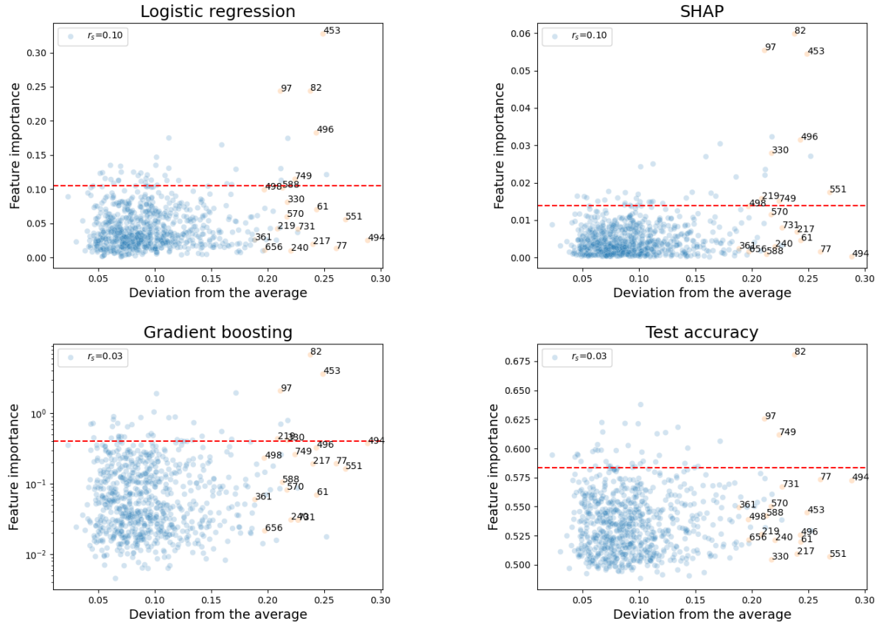

# Analysing the Importance of LLMs Embeddings' Components on Probing Linguistic Tasks
This repository contains the source code to reproduce experiments from the project for Skoltech Machine Learning course ([Paper](https://github.com/pkseniya/EmbeddingComponents/blob/main/paper/Analysing_the_Importance_of_LLMs_Embeddings__Components_on_Probing_Linguistic_Tasks.pdf), [Slides](https://github.com/pkseniya/EmbeddingComponents/blob/main/slides/slides.pdf)). 

Large language models (LLMs) have helped researchers to achieve tremendous results in the field of NLP. However, work is still being done on their interpretability, part of which is contextualized embeddings from LLMs. Previous works demonstrated that some dimensions in LLMs' embeddings are important to the representational quality of these embeddings for task specific knowledge. In this study, we analyze components' importance of LLMs by probing on simple tasks. Our results suggest that several embeddings' dimensions are directly responsible for definite linguistic properties.
## Setup
The implementation is on python and GPU-based. Tested with torch 2.2.1 and 1 Tesla T4 on Google Colab.

Local setup:
1. Clone this repository, for example, `git clone https://github.com/pkseniya/EmbeddingComponents.git`
2. `pip install -r ./EmbeddingComponents/requirements.txt` &ndash; installing the required libraries  
3. `pip install -e ./EmbeddingComponents/` &ndash; SentEval installation 
## Repository structure
All the experiments are issued in the form of pretty self-explanatory jupyter notebooks (notebooks/). For convenience, the majority of the evaluation output is preserved. Auxilary source code is moved to .py (feature_importance/).
### Experiments

- `python -m examples.bert` - computation of embeddings of probing tasks. Outputs the result into `datasets` folder.

- `notebooks/outliers.ipynb` &ndash; calculation of outlier dimensions of embeddings 

- `notebooks/outlier_vs_random_vs_all.ipynb` &ndash; comparing accuracues of logistic regression on all, outlier and random features 

- `notebooks/logreg.ipynb` &ndash; getting feature importance of embedding components with logistic regression 

- `notebooks/shap.ipynb` &ndash; getting feature importance of embedding components with shap and mlp 

- `python -m feature_importances.catboost` - getting feature importance of embedding components from gradient boosting.

- `notebooks/fvalue.ipynb` &ndash; getting feature importance of embeddings with ANOVA F-value 

- `notebooks/one_feature_classification.ipynb` &ndash; getting accuracy of predictions with single embeddings' component 

- `plot_methods.sh` &ndash; plotting feature importance vs deviation from the mean (outlierness of the component)
## Results
### Outlier dimensions perform better than random features on probing tasks

We trained the Logistic Regression model on ten probing tasks using different subsets of features of text embeddings: all features, 19 outlier features and 19 randomly chosen features. 

The results show that models trained on outlier features significantly out-perform models trained on the same number of randomly chosen features. Also we can notice that for some tasks quality on outlier features is comparable with the quality on all features (e.g. Length, oddManOut), while on some other tasks it’s significantly lower (e.g. WordContent). Therefore we can make a conclusion that outlier dimensions hold more information about the encoded sentence than other features.

### Several outlier dimensions with high feature importance for each task

We obtained feature importances for all probing tasks and plot the features in the axes Deviations
from the average - Feature importance. The results for BigramShift task can are presented in the plot.

It’s notable, that the fraction of outlier dimensions (orange) above the 95-percentile by importance is much larger than overall. There is a clear trend as well with outlier dimensions occupying upper-right corner of plot. Therefore, we conclude that outlier dimensions tend to have high feature importance.
### Few distinctive outlier dimensions with syntactic or semantic information

We check if outlier dimensions specify in some type of tasks. For that purpose we took results of catboost model. Probing tasks were divided in groups by linguistic properties they test: surface, syntactic, semantic. Also group of all tasks (general) was considered. Then, features which were in top of feature importances for every task in the group were found.

Some outliers capture paticular type of information, outlier dimension `61` specifies on surface information, `217` captures syntactic information. No outlier dimensions were found to be important for all tasks.
## References
### Analysing the Importance of LLMs Embeddings' Components on Probing Linguistic Tasks
Contact: [petrushina.ke@phystech.edu](mailto:petrushina.ke@phystech.edu)
### Credits
* [*SentEval: An Evaluation Toolkit for Universal Sentence Representations*](https://arxiv.org/abs/1803.05449), [Official implementation was used](https://github.com/facebookresearch/SentEval)
* [*A Unified Approach to Interpreting Model Predictions*](https://proceedings.neurips.cc/paper_files/paper/2017/hash/8a20a8621978632d76c43dfd28b67767-Abstract.html), [Official implementation was used](https://github.com/shap/shap)
* [*RoBERTa: A Robustly Optimized BERT Pretraining Approach*](https://arxiv.org/abs/1907.11692), [ Julien-c implementation on HuggingFace was used](https://huggingface.co/docs/transformers/model_doc/roberta)